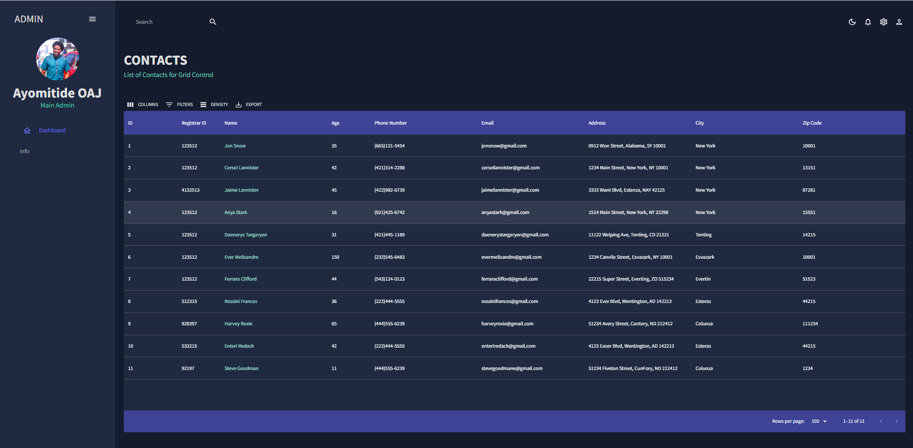

# React Admin Grid Control 


## Technology used
1. React (Typescript)
2. Material UI 
3. React-Pro-Sidebar
4. React Hooks


### This application consists of 
* Light & Dark Mode
* Contact Information Details
* X-Grid Table
* Filter Menus
* Pagination of Pages
* Sorting Menu


## Yarn base packages/lib...
|No | Packages Name                    | Description      |
|---|----------------------------------|------------------|
|01 |yarn add `react-router-dom`       | URL Navigation   |
|02 |yarn add `react-pro-sidebar@0.7.1`| React Pro Sidebar|
|03 |yarn add `@mui/material`          | [Material UI][mui] |
|04 |yarn add `@emotion/react`         | [Material UI][mui] |
|05 |yarn add `@emotion/styled`        | [Material UI][mui] |
|06 |yarn add `@emotion/styled`        | [Material UI][mui] |
|07 |yarn add `@mui/x-data-grid`       | [Material UI][mui] |
|08 |yarn add `@mui/icons-material`    | [Material UI][mui] |
|
<br />

## File & Folder Hierarchy

```
🟨
src
├── components
|   ├── Header.tsx
|   ├── index.ts
|
├── constants
|   ├── contactsColumns.ts
|   ├── mockData.ts
|   ├── sidebarMenu.ts
|
├── pages
|   |   index.ts
|   |
|   |
|   ├── global
|   |   ├── SidebarMenu.tsx
|   |   ├── SidebarMenuItem.tsx
|   |   └── Topbar.tsx
|   |
|   ├── info
|   |   ├── Contacts.tsx
|
├── styles
|   ├── index.css
|   └── theme.ts
|
├── App.tsx
└── index.ts
🟨

## SCREENSHOT


Caveat:
Setup Automated Deployment to Github pages, but apparently Github pages is not Free for Private repositories
